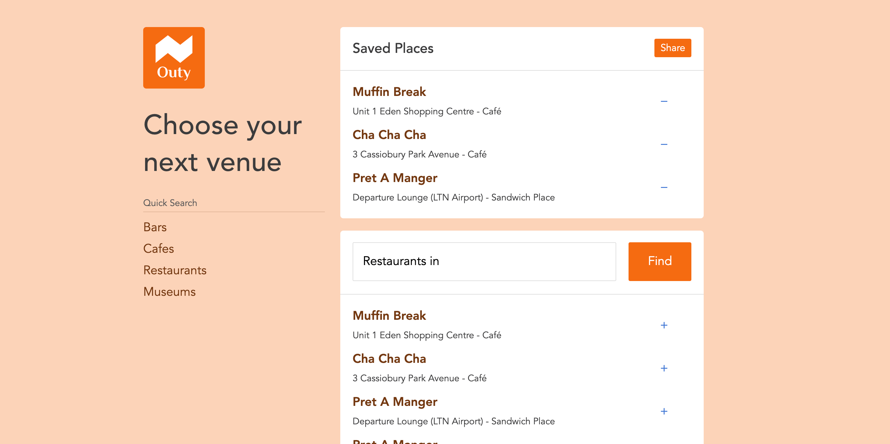

[Outy](https://outy-app.herokuapp.com/) is an app I developed to help solve the problem of choosing places to meetup with friends.

It uses the [Foursquare API](https://foursquare.com/) to fetch venues based on the geocode the user inputs in the search box. I designed the search functionality to be Google-esque in a way. So you can filter down by location by typing: `[category] in [place]` (e.g: Bakeries in Watford).

The app is powered using my favourite stack:

* [Node / Express](https://expressjs.com/)
* [Mongoose](https://mongoosejs.com/)
* [EJS](https://ejs.co)
* [Cutestrap](https://www.cutestrap.com/)
* [Heroku](https://heroku.com/)

It may seem super boring but it's actually super productive to not have to setup React, Webpack etc to get an app out the door. Especially since this app is just searching for locations.

Here's a full list of features:

* Location / Category search: Bakeries, Cafes, Muesuems, Bars, Gyms etc
* Create Polls to help decide where to go out
* Select and save venues for later

