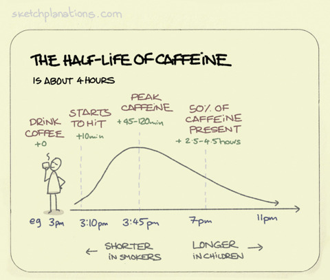
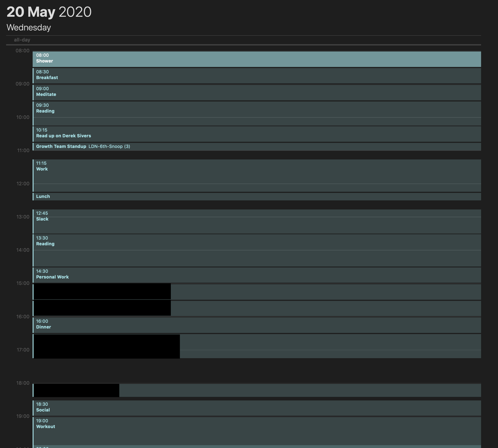

Since COVID I've been forced to be stuck at home, much like the rest of you (I hope). In the time I've felt my dependence on social apps like Instagram, Twitter, and Reddit has increased, slowly draining my energy and attention away from important projects of mine.

After a week or two of feeling lethargic I fired up my old Kindle and stumbled upon Make Time by Jake Knapp and John Zeratsky. It was a book I purchased and read a while ago but never really took much notice of.

In a nutshell while Jake and John were at Google they both felt like they were wasting time being distracted every day. So they developed a highlight, laser, energise and reflect system to improve their productivity.

## So what worked?

After 3 days of trying to find exactly how to implement the Make Time system I finally cracked it (well my interpretation of it). Here are the tactics that worked for me.

### No Caffeine after 4 pm

As a Developer, coffee is very much ingrained into our lifestyles from early on in our careers. I even have a Nespresso machine next to my bed! But I never really read up on coffee and it's side effects, I kinda just assumed energy for 1 hour and then have a crash sort of deal.

But that's not the case. Caffeine stays present within the body for up to 6 hours. This means any caffeine consumed after 4 pm will still be in the system while you're trying to get to sleep at 10 pm (not so good).

[https://www.sketchplanations.com/post/153511487793/the-half-life-of-caffeine-is-about-4-hours-the](https://www.sketchplanations.com/post/153511487793/the-half-life-of-caffeine-is-about-4-hours-the)

**So what were the benefits of this?**

*   I felt tired and fell asleep much earlier than I used to do. Around 10 pm rather than midnight.

### Thirty Minute Calendar

Every morning I'll wake up and plan out my day. I'll schedule every task I need to do from 8 am till 8 pm. This includes but not limited to Showers, Breakfast, Reading, Work, and Meetings. I aim for 30-minute events as they're the most realistic in terms of time spent.

My typical day on the Make Time schedule

If you're on a Mac I highly recommend importing both your work and personal calendars together. The default Mac calendar app makes it super easy to move around and adjust events as you move throughout your day.

**So what were the benefits of this?**

*   It completely removed the thought of "What's next?"
*   Increased my reading time from 1 hour to 3+ hours a day
*   I've made significant progress on an app idea of mine
*   My mornings feel more structured.
*   You can also look back on your day and see exactly where you spent your time.

### The Distraction Free Phone

Having just bought myself a new Pixel I was loving all the new features and ease of use of the operating system. One thing that caught my eye and changed everything for me this week was the "Focus Mode" feature (Downtime on IOS devices).

[https://www.blog.google/products/android/android-focus-mode/](https://www.blog.google/products/android/android-focus-mode/)

Having the ability to choose which apps to allow notifications and access to for a while is game-changing. No more Twitter, Instagram, or FreeTrade notifications. If I want to take a break I can disable it for 5-10 minutes and it even comes with a timer that auto enables it after a short break.

**So what were the benefits of this?**

*   Screen time went from around 7hrs to 5hrs (I sometimes use Kindle on my phone which takes up an hour a day)
*   I was less distracted when in my "flow" which resulted in 3-4 hour development and reading sessions.
*   My workouts were finished within 40 minutes instead of 1.2 hours. I check my phone during the rest time.

## So what didn't work?

As with anything in life, nothing is guaranteed to work 100% of the time. I felt a lot of the tactics in the book were common sense or just a utopian style sort of thinking. Here are a few notable things that didn't work for me:

### Highlights

The Highlight method in Make Time is a way of choosing what your focus will be for that day. For example: "Talk a walk" or "Write 10 pages for my new book".

Instead of stressing over whats the most important highlight for your day. I recommend just setting aside time in your calendar to focus on personal projects instead of individual tasks (reminds me of Paul Graham's "[Maker's Schedule](http://www.paulgraham.com/makersschedule.html)" article).

This will give you the time to decompress and work on whatever pops into your head as you go about your day.

### Reflections

I love to reflect on my performance. I generally like to use the 80/20 Pareto/Tim Ferriss reflection methods at the end of every month as a sort of general overview of my time.

Make Time's reflection exercises revolves around the book:

1.  Note down your Highlight
2.  Rate out of ten how focused you were that day
3.  Rate out of ten how energised you were that day
4.  What tactics worked for you?
5.  What tactics do you want to try tomorrow?

As per my previous statement. I don't think the Highlight is very important here. Not only that but the tactics questions just aren't all that useful either. If I'm distracted by my phone I'm not going to try a different tactic tomorrow. I'm going to need to stop using my phone.

I feel like I'm nitpicking but this part of the book should be about where you spend your time rather than how you feel.

### Common Sense

A lot of the book felt like common sense. For example:

*   Increase your energy by exercising
*   Eating healthy
*   Answer emails in one go
*   Plan out your day
*   Delete social media apps

## So what's the rating?

### 4/10

**Pros:**

*   Useful for people who haven't read productivity books before
*   Cute and simple illustrations.
*   Easy to implement tactics.

**Cons:**

*   A lot of the book is just common sense
*   Few tactics have that much of a dramatic impact.
*   Highlight and Reflect exercises are too tied to the book and or aren't used throughout the day.