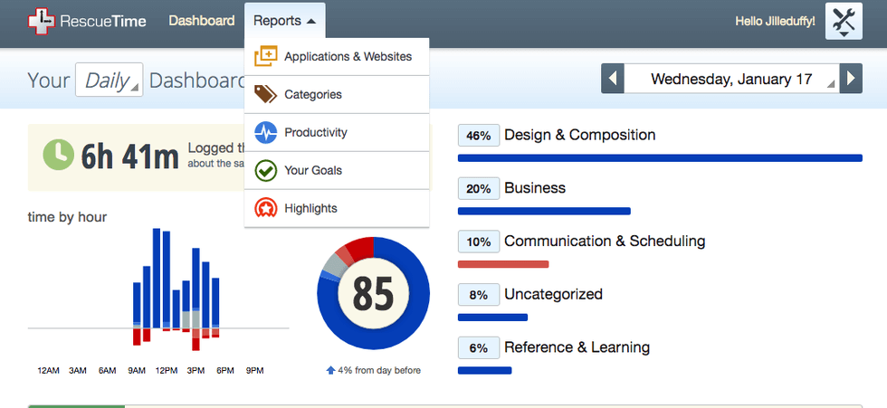
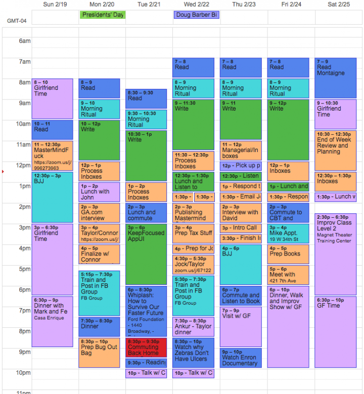
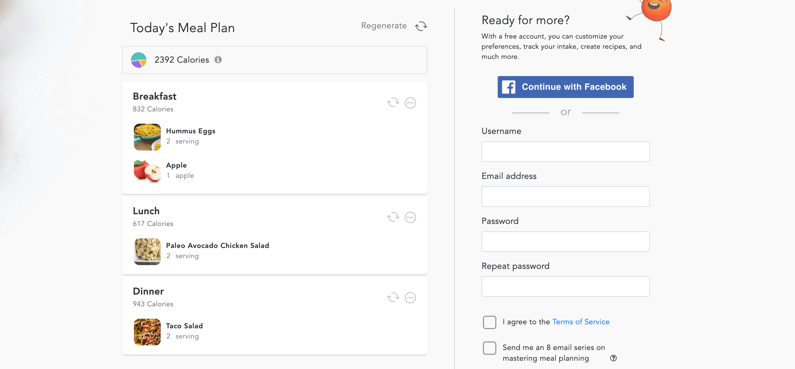
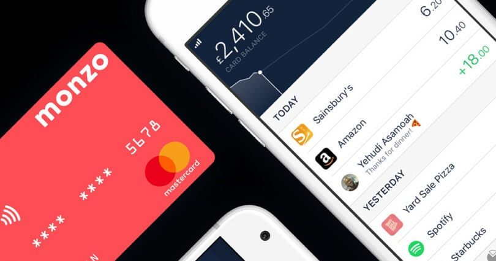
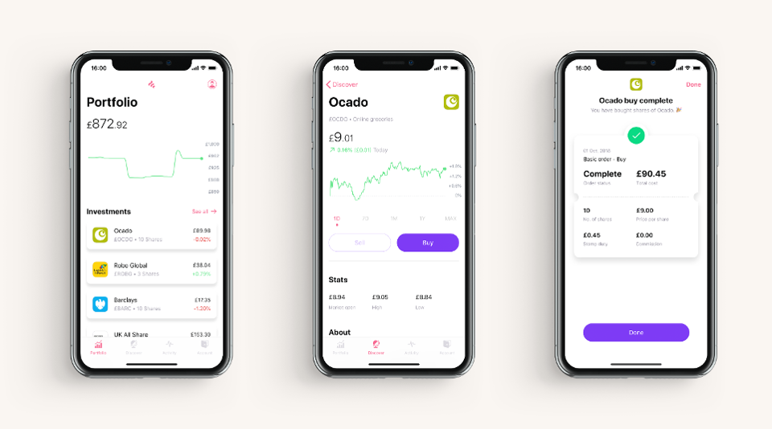
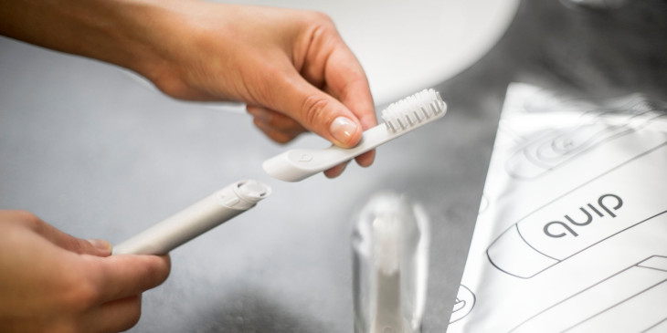
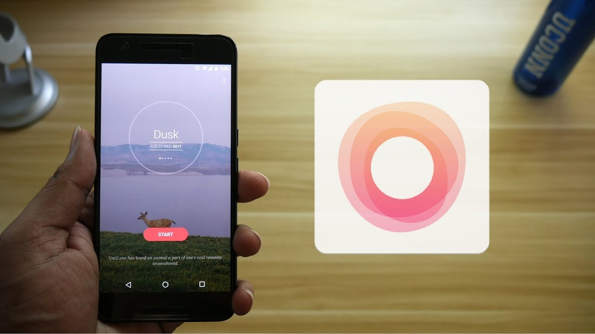

Over the last few years I've collected a variety of tools to help cut down my wasted time. Here's a few tools that I found incredibly helpful:

# Time Tracking

**RescueTime**

There is probably a million time tracking apps at this point but one tool in particular which I kept getting recommended to me is [RescueTime](https://www.rescuetime.com/).

RescueTime has a variety of great features that surpass many of the other tracking apps:

* Cross Platform Apps: Chrome, Desktop, Mobile.
* Daily, Weekly, Monthly summaries.
* Huge categorisation database to aggregate from.
* Set Goals for how you spend your time
* Compare your time against people in the same industry as you

I've used RescueTime to identify that I spent way too much time on Instagram and Reddit. Having cut those down my productivity hours has increased to fill those 2-3hrs I was wasting.

**Google Calendar**

One of the most used calendar apps on this earth, Google Calendar is unbeatable when it comes to convenience and platforms. 

Did you know that you can also write scripts for Google Calendar? If you head to [script.google.com](https://script.google.com/home) you can create/run/share scripts that are run on the Google Cloud.

A way that I manage my time using GCal is to colour code my events. This gets repetitive if you're manually making events each day but [if you do a bit of programming magic](https://rickpastoor.com/2019/05/30/google-calendar-color-coder.html) you can have it colour code your week every 15 minutes:

## Task Management

When it comes to Todo lists there are a few things I look for:

1. Clean and simple interface
2. Dates/Reminders to do different tasks
3. Add descriptions / urls to the todos

With those criteria, I ended up stumbling across [TickTick](https://ticktick.com/home). [TickTick](https://ticktick.com/home) is an app which nails the Todo list experience and also helps me jot down every idea/task that I have throughout my day.

[TickTick](https://ticktick.com/home) also packs in a load of other great features:

* Cross Platform Support
* Calendar View
* Tagging
* Habits
* Streaks
* Prioritising

## Mail

I'm not one of those people who suffer from ridiculous amounts of email a day (sometimes I wish I did). However when I do get an important email in the morning [I snooze it](https://support.google.com/mail/answer/7622010?co=GENIE.Platform%3DDesktop&hl=en) until 2pm, this is because I like to keep my mornings focused and peaceful.

[Gmail](https://gmail.com), a Google owned mail client allows me to do just that from any platform.

_I'm not gonna put a picture here, you know what it looks like._

## Food

**Lifesum**

If you're into fitness like myself, calorie tracking is a must have for ensuring your body is getting the energy it needs to lose/gain weight.

There are two main apps which fight it out regularly for the best fitness app and those are [MyFitnessPal](https://www.myfitnesspal.com/) and [Lifesum](https://lifesum.com/).

I'm a [Lifesum](https://lifesum.com/) fan mainly because of their friendly UI and diet plans that they have on the app 🥗. But feel free to try both and see which one works best for your routine:

Price: £7 per month

**Eat This Much**

You don't just need to track your calories to be healthy. You also need to eat the right kind of food in the right amounts.

Adjusting recipes to fit those amounts is a chore, something I used to spend hours on each day. But thankfully [eatthismuch.com](https://www.eatthismuch.com/) has me covered.

[Eat This Much](https://www.eatthismuch.com/) is a web tool that generates meal plans based on your diet preference and calories needed per day. It works amazingly well as it keeps the recipes it generates simple and easy to make.

Here's an example of my Paleo meal plan:

## Finance

If you haven't yet, read [I will teach you to be Rich](https://www.iwillteachyoutoberich.com/book/) by Ramit Sethi. This will teach you about Interest rates, Index Funds and automating your finances.

With that said, I use 3 apps to help me manage my finances:

**Monzo**

Not a day goes by where I don't want to move away from Monzo. Monzo for those outside the UK is challenger bank and is fully digital. You can open up sub accounts within your account to segment your money and manage direct debits etc straight from your phone.

One time saving killer feature is bill splitting. Simply tap on a transaction and choose your friends from your contacts and Monzo will split the bill evenly between you and your friends.

**Wealthsimple**

Index funds are a collection of the top performing stock in that current time. Index funds historically have risen for the last 100 years and are a great way to accumulate high interest on your money.

[WealthSimple](https://www.wealthsimple.com/en-gb/) is a service that auto-invests your money for you and reinvests any dividends back into that lump sum so it compounds over the years.

**FreeTrade**

[FreeTrade](https://freetrade.io/) is an app that let's you trade from your phone and doesn't charge commission on buying/selling stocks. You can invest your money into Index ETFs, Bond ETFs and individual stocks.

## Cosmetics

**Quip**

Having an electric toothbrush is paramount to a healthy dental hygiene. [Quip](https://www.getquip.com/) is a service that handles replacing your electric toothbrush head every 3 months by sending you a new head, battery and toothpaste.

Not only does this save me time but it also helps me look forward to brushing my teeth as the brush itself is beautifully designed as well:

Price: £7.65 every 3 months

**Harry's**

On the same vein as Quip, [Harry's] (https://www.harrys.com/en/gb) is a Razor company that every 3 months sends me replacement heads for my Razor.

What shocked me when I first tried Harry's is the quality of the Razor compared to my Gillette, it was noticeably sharper and the packaging even advised me to take it slower when I first used it.

Price: £14 every 3 months

**Asos**

I hate retail. I hate going around all the shops trying on clothes. With [Asos](https://www.asos.com/) you can shop a variety of different brands and get sizing recommendations based off your height, weight and preferred fit.

## Flow

**Headspace**

It's important to disconnect and refocus using meditation. [Headspace](https://www.headspace.com/) is the number one app for meditation and frankly it deserves it. It has lessons for each different thing you could want from NBA motivational meditations to sleep stories.

Price: £10 per month

**Tide.fm**

Natural music helps me concentrate and achieve flow with my work. I prefer to use [Tide](https://tide.fm/en_US/) over [Noisli](https://www.noisli.com/) as Tide offers way more custom sounds like instrumentals and nature sounds. [Tide](https://tide.fm/en_US/) also let's you set a timer for how long you want to focus for.

