During lockdown I've been giving myself a few 30 days challenges:

1.  30 Days of no cheat meals - I wanted to break out of the habit of cheating on my diet on Fridays
2.  30 Days of blogging - I used to write back in the early [Medium](https://medium.com/) days and I missed it so I decided to push myself to write everyday.

I've been tracking the progress using [Google Calendar](https://calendar.google.com/calendar):

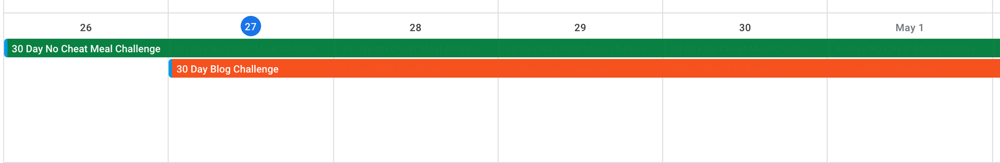

Both my challenges on my Google Calendar

I had the idea to make a challenges website where users could submit challenges and readers could one click add those challenges to their google calendar.

## Building the Initial Landing Page

We're going to use [Squarespace](https://www.squarespace.com) to whip up a quick landing page for our challenges site. I'm going with the Bailard template:

The existing template has a really good Hero title :)

Let's change up the copy to reflect what we're trying to achieve with this website:

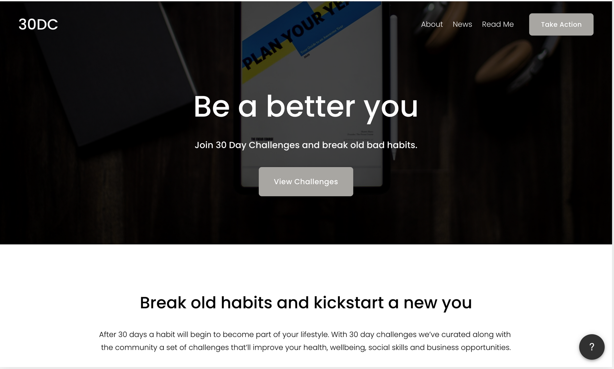

This is why I love Squarespace

Looking good! Now under our next section we need to add a code element (don't worry you're not going to be coding). In order to do that you need to:

1.  Add a blank section. It will be the first option.
2.  Click the inner text element prompt:

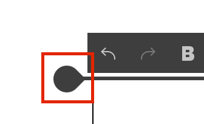

Whatever you call what this is

3\. Click the Code option

## Curating the Challenges Database

Now that we have a website to display our challenges. We also need a database to host our challenges. Introducing [Airtable](https://airtable.com/), It's a spreadsheet on steroids and if you've read any no-code article before this one you've most likely heard about it.

So let's create a new workspace/table for 30 day challenges:

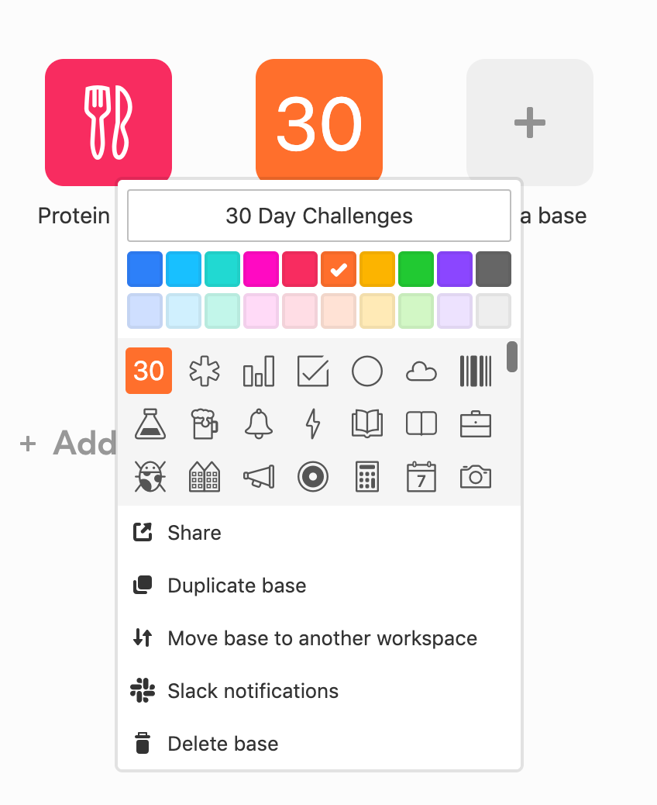

I should probably make the icon fancier

Once you've done that let's head on over to the table itself and add a few fields:

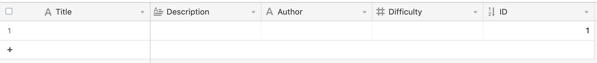

Our brand new challenges database

I've added 5 fields for our challenges:

1.  Title (single text) - Short summary of what the challenge is
2.  Description (long text) - Long form content on what to do everyday
3.  Author (single text) - For the user to add their Twitter for clout
4.  Difficulty (number) - Out of 5 how difficult is this challenge
5.  ID (auto-increment) - Auto incrementing ID just in case ;)

Let's add some example challenges just so we have something to display:

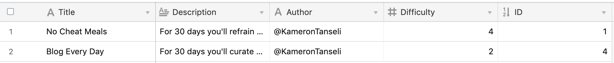

I've added my challenges but feel free to add your own

To add the Table to our site we need to click the "Share" button in the top right corner:

Click that juicy share button. Go on!

Then you want to click on the create shared view option:

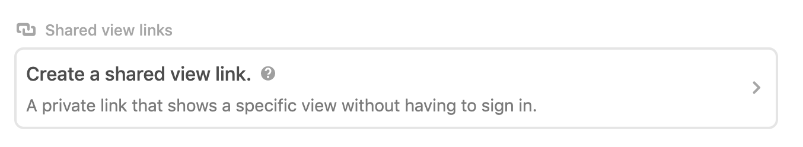

Next click the share current view option:

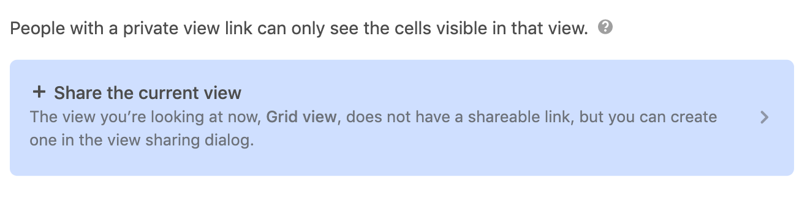

Then click the create embeddable link button (you think they would make this have less steps???):

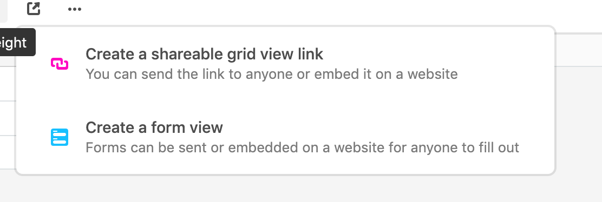

And then click the embed in your site option:

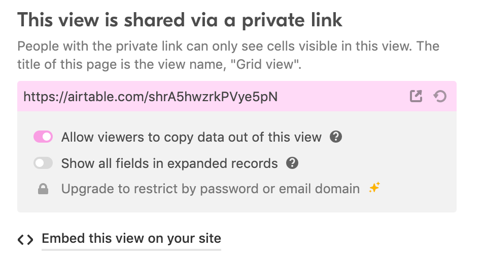

You'll be taken to a [page like this](https://airtable.com/shrA5hwzrkPVye5pN/embed):

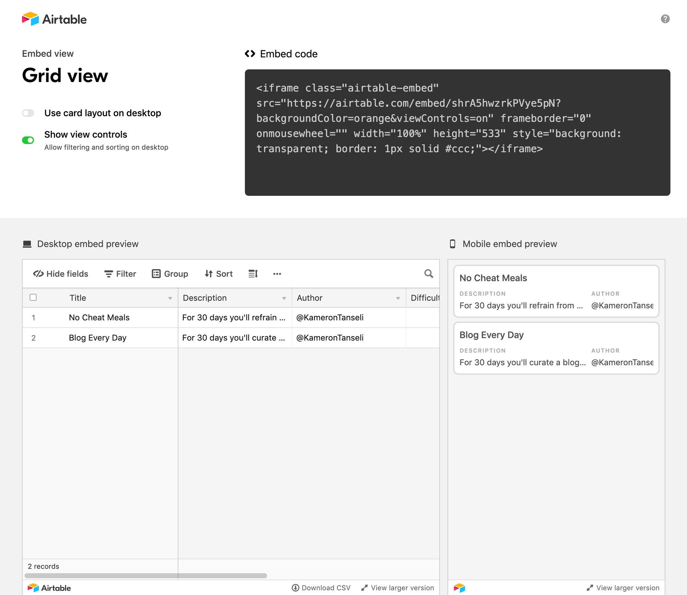

Set the options to use card layout and disallow filtering for now:

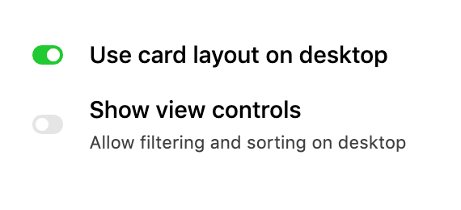

## Displaying our Challenges

Then **copy the embed code** and head back to the website to paste it into the code block:

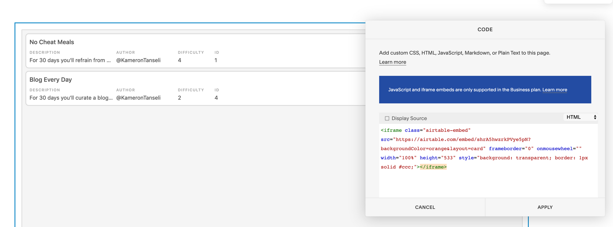

Why are embeds always a premium option :(

You website now should look something like this:

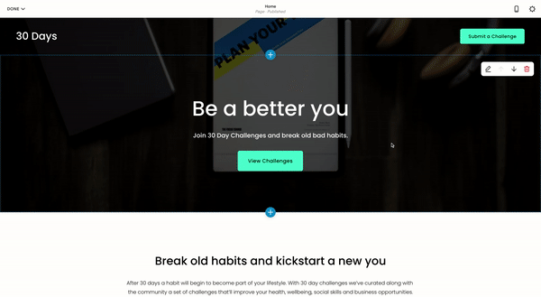

Looking Spicy 

## Adding Google Calendar Support

How do we add GCal support without writing any code? Links! Google calendar supports a certain format of URL which can automatically add events to a users calendar.

Let's use this [free tool](https://jennamolby.com/tools/google-calendar-link-generator/) to see what the URL should look like:

    http://www.google.com/calendar/event?action=TEMPLATE&dates=20200501T010000Z%2F20200530T010000Z&text=30%20Day%20Challenges
    

As you can see from the above URL we need to add:

1.  _action=TEMPLATE_ - This tells Gcal that this link is for making an event
2.  _dates_ - This is how we set the dates for Gcal to add the event

In order to add this functionality to Airtable we're gonna have to write a formula. So let's first make a new field called "Add to Calendar":

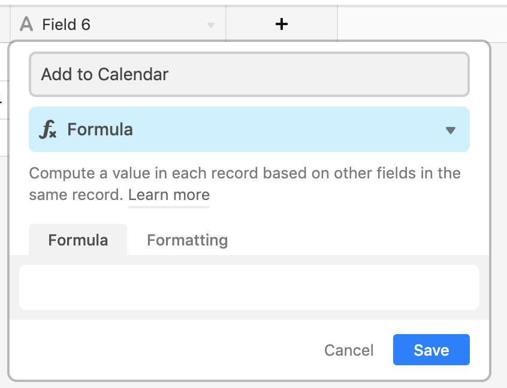

Formulas allow us to manipulate values using functions that Airtable provides. I've put together a formula to generate the calendar links:

    CONCATENATE('http://www.google.com/calendar/event?action=TEMPLATE&dates=', DATETIME_FORMAT(NOW(), 'YYYYMMDD'), '%2F', DATETIME_FORMAT(DATEADD(NOW(), 30, 'day'), 'YYYYMMDD'), '&text=', ENCODE_URL_COMPONENT(Title))
    

Now if we go back to our site we'll see that our entries have "Add to Calendar" links:

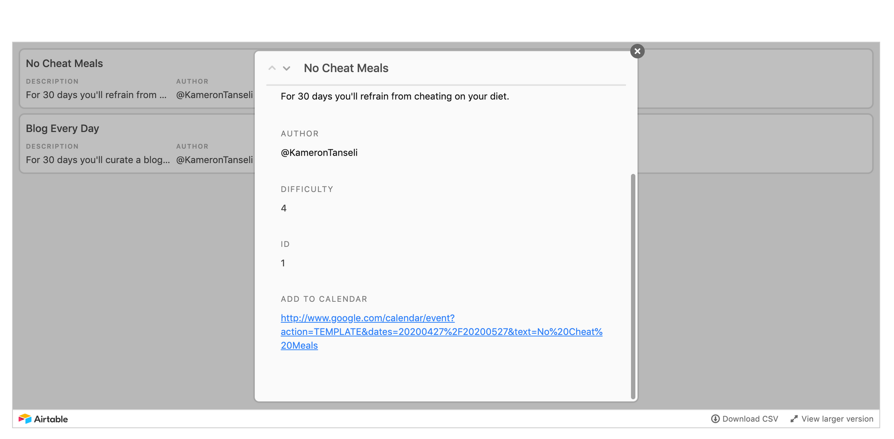

WooHoo now you can click and add it to your calendar!

## Adding Submissions

In order to add submissions we need to create an Airtable form. To do so create another table and call it "Submissions":

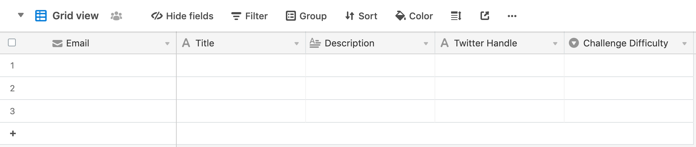

*   Email
*   Title (single text)
*   Description (long form text)
*   Twitter Handle (single text)
*   Challenge Difficulty (select with options 1 - 5)

Add the above five fields and then follow the steps we did earlier to embed a table but instead select the form view option:

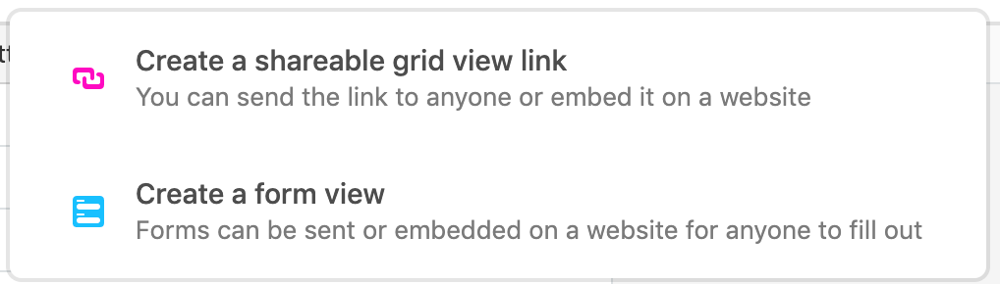

Please select "Create a form view"

You'll be rewarded by seeing a form like this appear:

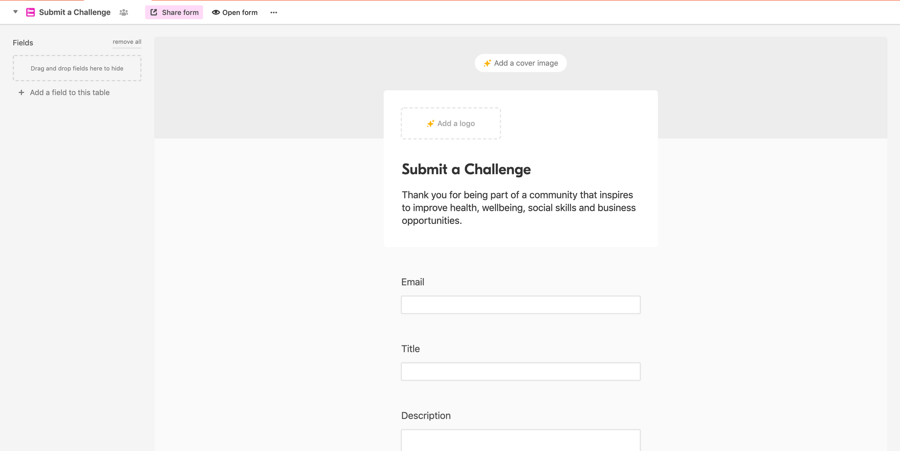

Airtable is a lifesaver

Click "Share form", copy the link and add it to your website:

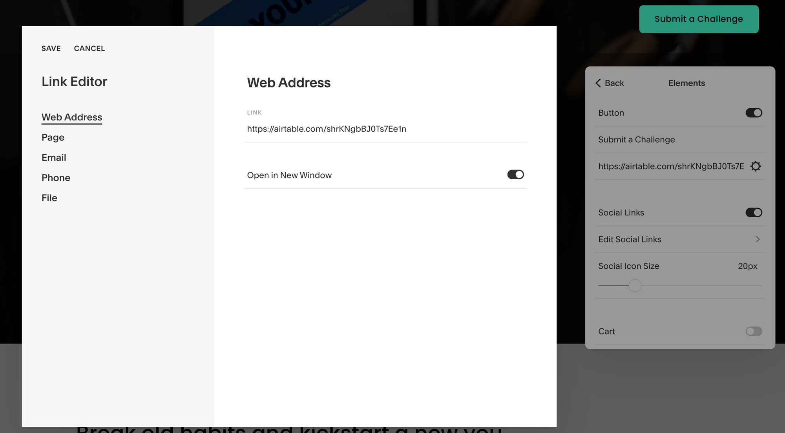

Almost like magic

## Conclusion

We've made it! We have a [running site](https://horse-vuvuzela-ph4p.squarespace.com/home) (password is 30days). As you can see we can view and add challenges to our calendar as well as submit challenges using the button in the top right corner.

The world is your oyster now. Go and create some kick ass sites. Here's a few of my node-code favourites:

*   [https://roadtoscale.com/](https://roadtoscale.com/)
*   [https://startupstash.com/](https://startupstash.com/)
*   [https://budgetmealplanner.com/](https://budgetmealplanner.com/)