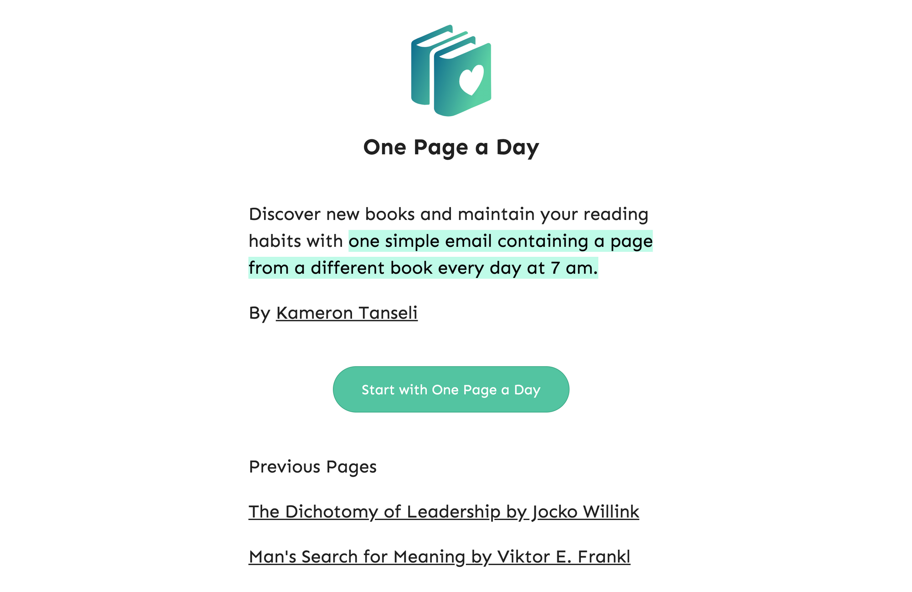
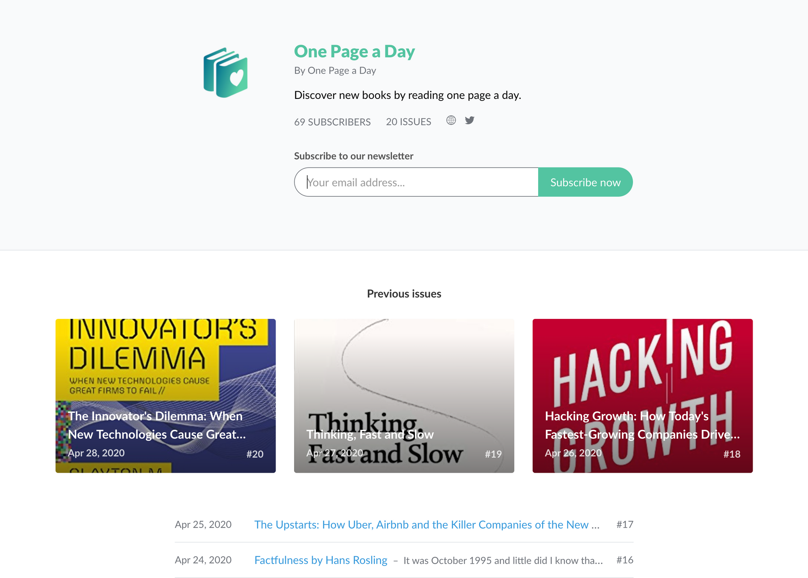
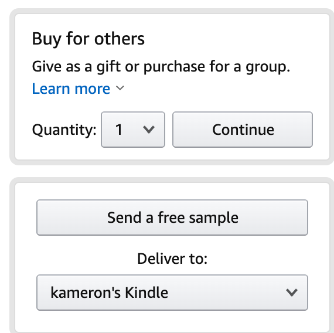
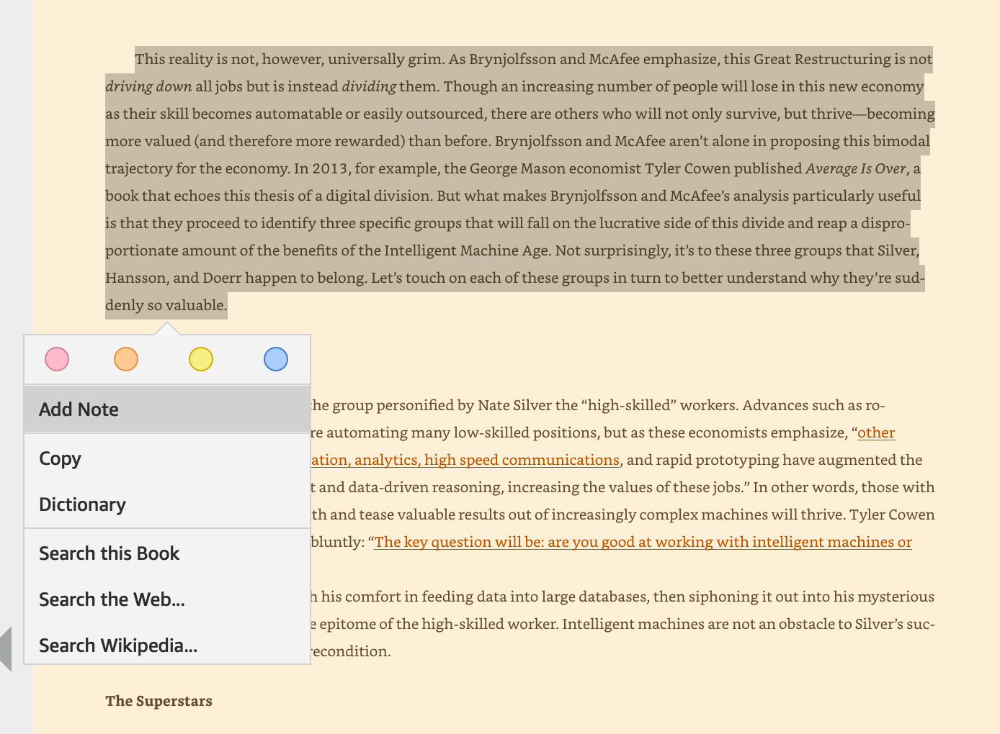
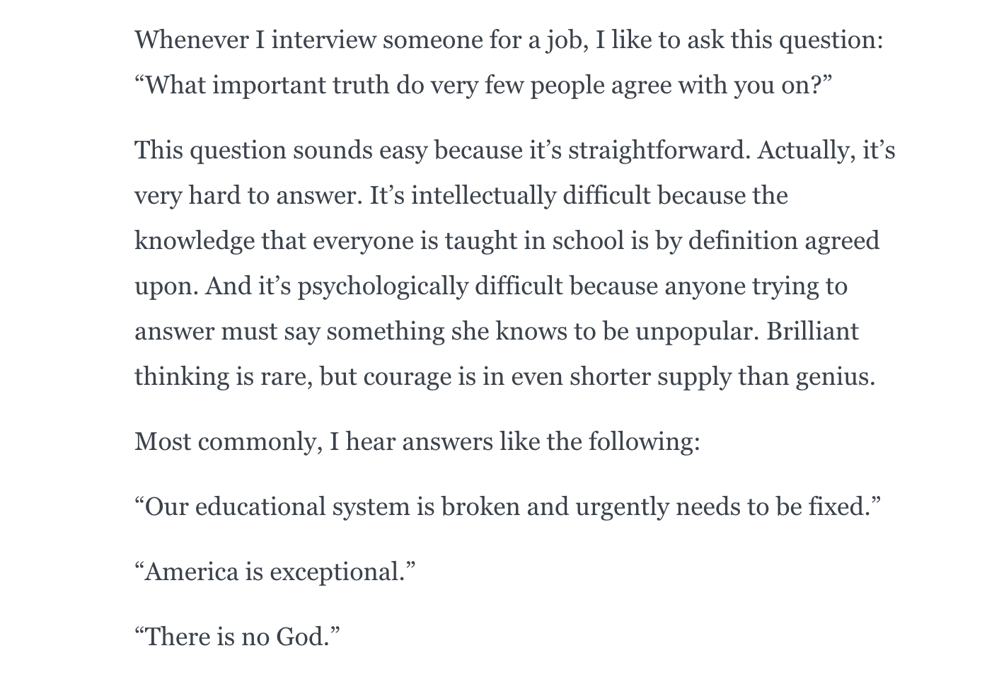
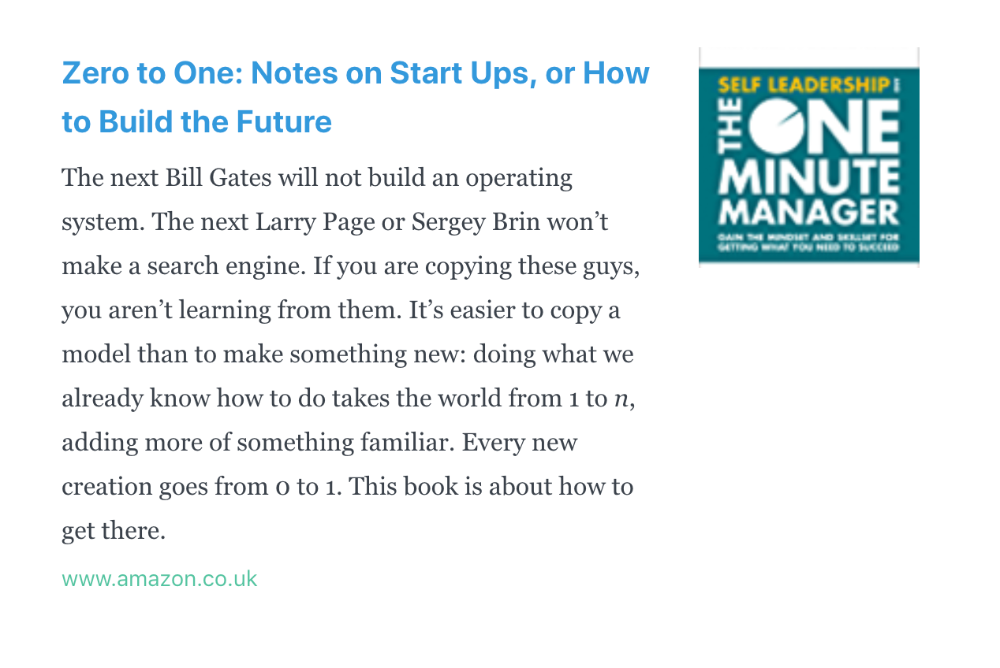
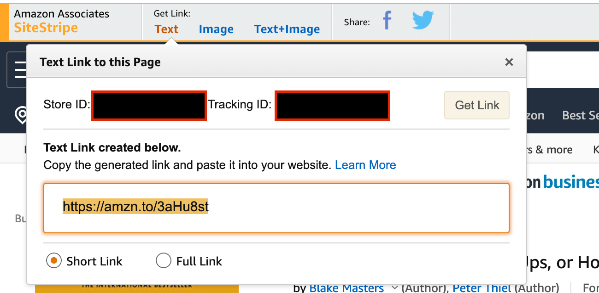
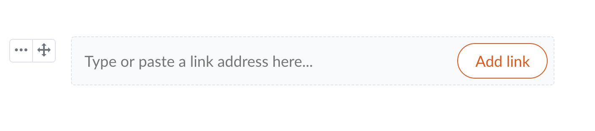

If you've been following my activity on Twitter you would have seen my latest project, [One Page a Day](https://onepageday.co.uk/), an email service that sends you one page from a new book every morning at 7am.

One Page a Day Landing Page

In this article I'm going to go through how exactly the whole service works.

## Landing Page (Free)

I quickly coded a simple landing page and deployed it for free using [Netlify](https://netlify.com/). The landing page links to the newsletter service.

## Revue ($5 per month)

This whole service wouldn't be possible without [Revue](getrevue.co). Revue is an email newsletter service that allows you to build and send emails to a list of email subscribers.

One Page a Day's Revue Sign Up Page

## Amazon Kindle Free Samples (Free)

In order to provide one page from a new book everyday. I use the "Send a free sample" option to get the first few pages a popular book:

The free sample contains all that I need to send a teaser of a book to my readers

Then if you open it on the [Kindle](https://apps.apple.com/us/app/amazon-kindle/id302584613) app you can select and copy the text straight out of the sample:

Kindle's copy feature

**Note:** Amazon limits the amount of text you can copy to stop plagiarism from ebooks.

Then all I do is paste it into Revue and correctly format any issues with the text:

Copied Kindle Text into Revue

## Amazon Affiliate Links

In order to break even with running costs I add affiliate links at the bottom of every book I send out:

Amazon Affiliate Links

You can add these to your Revue emails by inserting the affiliate link at the bottom of the email:

Amazon Affiliate Link Example

Adding a link has never been easier

## Conclusion

Building an email newsletter startup has never been easier. I could have saved time by using a [no-code website builder](https://squarespace.com) to make the landing page and [outsourcing](https://www.getfriday.com/) the book copy and pasting but all in all it takes me around 1 hour a week to run [One Page a Day](http://onepageday.co.uk/).