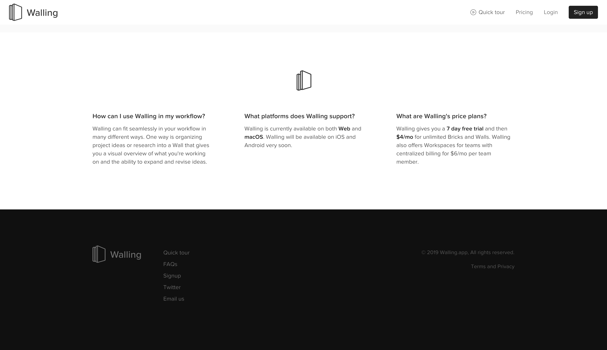

[Walling](https://walling.app) is an app that helps you organise your ideas into boards. Kinda like Google Keep but a whole lot prettier.

What drew me to their landing page in particular is their use of whitespace and clear copy to drive home what they're trying to achieve.

Their opening line, "A Better Way to Organize & Refine Ideas", let's the user know what the main purpose of this app is. Simply put they have made a better way to take and organise notes or designs.

Whats also cool is that their subtitle goes through different use cases for the app: "Working on a project, researching a topic or writing an article?". This done to relate to the customers wants as most note taking app customers are using the tool in 1 of those 3 ways.

Let's talk about CTAs, especially when you have 3 of them. It can be tempting to make each CTA of equal importance but this would spell confusion and add a lack of direction for the customer.

Instead Walling has made the sign up form huge and prominent compared to the rest of the CTAs. Not looking to give up your email yet? Why not watch a video of how it works? Not interested in watching a video? Try a demo of our product! They covered each different type of interest level and kept it from being problematic by having each level reduce in size and colour.

Scrolling down reveals why we should use Walling. They have kept it rather brief in order to show off the true USP of the product which is it's User Interface, which you can see playing as a GIF in the right hand side.

Let's go through each reason:

1. "Brain dump with ease"
   * Clear and simple. I know as a creative person myself that just vomiting information into a notes app is one of the most common use cases.
   * They distinguish themselves from normal note apps by saying "Unlike linear documents, with Walling you can throw out your ideas into Bricks". This is a good example of pushing their USP to the customer.

2. "See the big picture"
   * Walling's USP is to have all your ideas present in one big screen like a real Pinboard. They push this across well: "Walling empowers you to step back and get a high level understanding".
   * They're not done yet. Below this point you get links to examples of completed boards where you can see for yourself the "big picture".

Now we're getting to the push for driving a sign up. Highly relevant quote from ProductHunt is situated above the form as a last ditch effort to entice customers to sign up.

Notice how in the form they have again listed out every target customer in their byline: "whether you are a designer, a developer, a project manager, a writer or even a non-tech.". This is done to reach out and personalise their customer and reassure them that this product can be used in their role.

Lastly let's take a look at their FAQ section.

1. "How can I use Walling in my workflow?"
   * I'm not sure this is needed that much and probably the actual question Walling might be asked is: "Do you offer an integration to my existing tools?".
2. "What platforms does Walling support?"
   * Walling should have added download buttons as their CTAs instead of chasing emails. Not only do they get an app on their user's device which would increase engagement but also customer's know whether or not they can use Walling.
   * Having to scroll all the way down to get this information is very helpful and feel somewhat deceitful.
3. "What are Walling's price plans?"
   * "Walling gives you a 7 day free trial and then $4/mo for unlimited Bricks and Walls." - Wow this is amazing only $4/mo for this app ?!? If only they shouted about this more, having the sign up forms made it feel like the app wasn't ready yet, I bet for this price a lot of creatives would try this out.
   * "Workspaces for teams with centralized billing for $6/mo per team member." - Wait what? So $4 for a single user? And then $6 for a team member? Why not $4 per team member? Don't just increase pricing because its a company, when we can see you can clearly afford $4 per user!

## Score: 6.5/10 - Minimal, Beautiful, Case study rich but lacks transparency